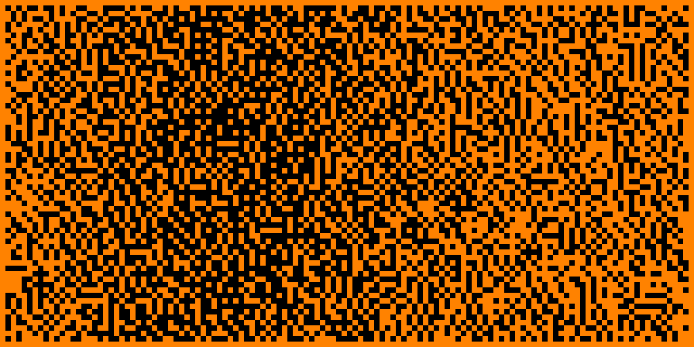
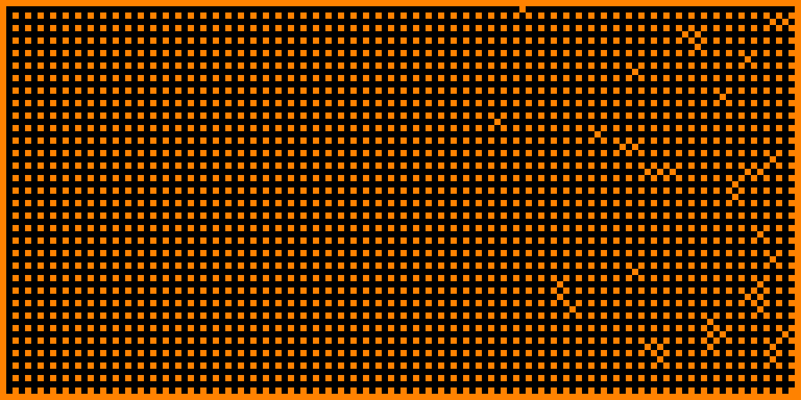
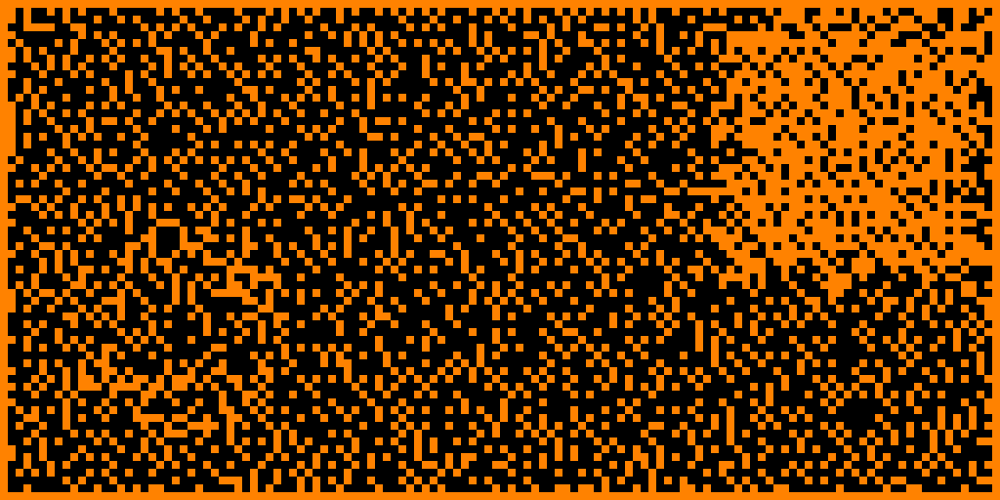

# Flipper Zero Generative Art

Real-time generative art and animated patterns for the Flipper Zero's 128x64 monochrome display. Uses Floyd-Steinberg dithering to produce smooth, evolving visuals at 30 FPS.

## Gallery

<div align="center">

 

 


</div>

## Features

- **10 pattern types** -- horizontal, vertical, radial, diagonal, sine, cosine, interference, checkerboard, noise, spiral
- **Real-time animation** at 30 FPS with auto-evolving parameters
- **Floyd-Steinberg dithering** for high-quality 1-bit rendering
- **Interactive controls** for live pattern and frequency adjustment
- **Built-in help screen**

## Controls

| Button | Action |
|--------|--------|
| OK | Generate new random pattern |
| Up / Down | Change gradient type |
| Left / Right | Adjust frequency / animation speed |
| Back | Show help screen |
| Back (hold) | Exit |

## Installation

### Pre-built .fap (easiest)

1. Download `flipper_generative_art.fap` from the [latest release](https://github.com/ejfox/flipper-generative-art/releases/latest).
2. Connect your Flipper Zero via qFlipper or mount the SD card directly.
3. Copy the `.fap` file to `SD Card/apps/Graphics/` (create the folder if it does not exist).
4. On the Flipper, open **Apps > Graphics > Generative Art**.

### Firmware compatibility

The pre-built `.fap` in releases is compiled for **Momentum firmware mntm-009** (API 79.2). If you are running a different firmware or API version, you will need to build from source (see below).

## Building from Source

The recommended way to build Flipper Zero apps is with [ufbt](https://github.com/flipperdevices/flipperzero-ufbt) (micro Flipper Build Tool).

### 1. Install ufbt

```bash
pip install ufbt
```

### 2. Set up the SDK

For **Momentum firmware** (recommended if you use Momentum):

```bash
ufbt update --index-url=https://up.momentum-fw.dev/firmware/directory.json
```

For **stock Flipper firmware**:

```bash
ufbt update
```

### 3. Clone and build

```bash
git clone https://github.com/ejfox/flipper-generative-art.git
cd flipper-generative-art
ufbt
```

The compiled `.fap` will be in the `dist/` directory.

### 4. Deploy directly to Flipper (optional)

```bash
ufbt launch
```

This builds, copies the `.fap` to your connected Flipper, and runs it.

## File Structure

```
flipper-generative-art/
  application.fam            # App manifest
  flipper-lightweight-gen.c   # Main application source
  icon.png                   # App icon (10x10)
  README.md
```

## Technical Details

- **Display**: 128x64 monochrome LCD
- **Rendering**: Floyd-Steinberg error-diffusion dithering
- **Frame rate**: ~30 FPS real-time
- **Memory**: Minimal footprint, single-file application

## License

MIT -- see [LICENSE](LICENSE).
