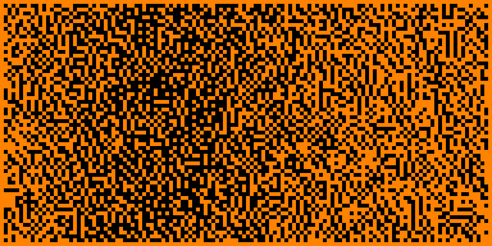
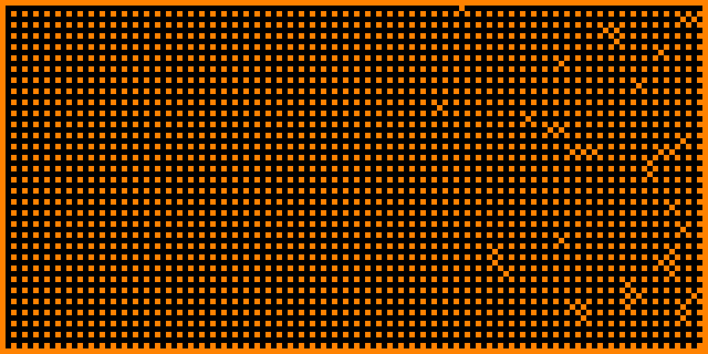
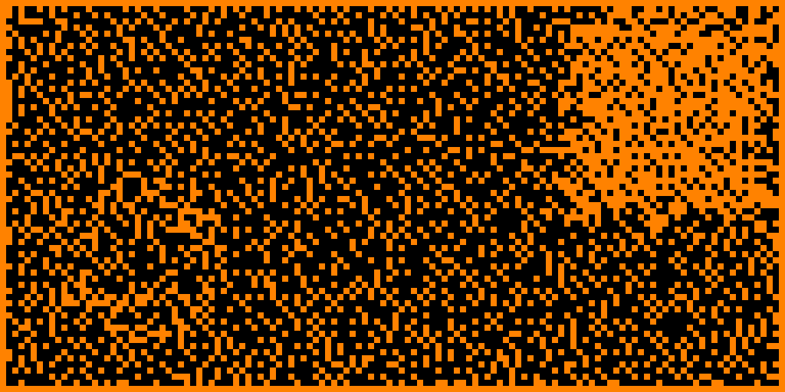

# Flipper Zero Generative Art

Real-time generative art engine for the Flipper Zero's 128x64 monochrome display. Fractals, demoscene effects, layer blending, and multiple dithering algorithms at 30 FPS.

## Gallery

<div align="center">

 

 


</div>

## Patterns

**Classic**
- Horizontal, Vertical, Radial, Diagonal
- Sine Wave, Cosine Wave, Interference, Checkerboard
- Noise, Spiral

**Fractal / Hacker**
- Mandelbrot -- infinite zoom into Seahorse Valley
- Julia Set -- animated orbiting c parameter
- Plasma -- classic demoscene sum-of-sines
- Perlin Noise -- multi-octave with animation
- Moire -- drifting concentric ring interference
- Sierpinski -- XOR fractal with scroll

## Layer Blending

Overlay any two patterns with a blend mode:

| Mode | Effect |
|------|--------|
| XOR | Bitwise XOR -- glitchy, digital |
| AND | Bitwise AND -- intersection |
| OR | Bitwise OR -- union |
| Add | Additive (clamped) -- brightens |
| Multiply | Darkens overlapping areas |
| Diff | Absolute difference -- edges |
| Screen | Inverse multiply -- lightens |

## Dithering

| Algorithm | Character |
|-----------|-----------|
| Floyd-Steinberg | Smooth gradients, classic error diffusion |
| Bayer 4x4 | Ordered halftone, newspaper print feel |
| Atkinson | High contrast, old Mac aesthetic |
| Threshold | Hard black/white, no dithering |

## Controls

### Config Screen

Use Left/Right to cycle through options. Press OK on any item to launch the canvas.

| Setting | Options |
|---------|---------|
| Pattern | All 16 patterns |
| Layer | None, or any pattern as overlay |
| Blend | None, XOR, AND, OR, Add, Multiply, Diff, Screen |
| Dither | Floyd-Steinberg, Bayer 4x4, Atkinson, Threshold |
| Auto-evolve | Off / On |

### Canvas

| Button | Action |
|--------|--------|
| Up / Down | Cycle pattern |
| Left / Right | Adjust frequency (hold to repeat) |
| OK | Randomize seed and frequency |
| OK (hold) | Toggle invert |
| Back | Return to config |

## Installation

### Pre-built .fap (easiest)

1. Download `flipper_generative_art.fap` from the [latest release](https://github.com/ejfox/flipper-generative-art/releases/latest).
2. Connect your Flipper Zero via qFlipper or mount the SD card directly.
3. Copy the `.fap` file to `SD Card/apps/Graphics/` (create the folder if it does not exist).
4. On the Flipper, open **Apps > Graphics > Generative Art**.

### Firmware compatibility

The pre-built `.fap` in releases is compiled for **Momentum firmware mntm-009** (API 79.2). If you are running a different firmware or API version, you will need to build from source (see below).

## Building from Source

The recommended way to build Flipper Zero apps is with [ufbt](https://github.com/flipperdevices/flipperzero-ufbt) (micro Flipper Build Tool).

### 1. Install ufbt

```bash
pip install ufbt
```

### 2. Set up the SDK

For **Momentum firmware** (recommended if you use Momentum):

```bash
ufbt update --index-url=https://up.momentum-fw.dev/firmware/directory.json
```

For **stock Flipper firmware**:

```bash
ufbt update
```

### 3. Clone and build

```bash
git clone https://github.com/ejfox/flipper-generative-art.git
cd flipper-generative-art
ufbt
```

The compiled `.fap` will be in the `dist/` directory.

### 4. Deploy directly to Flipper (optional)

```bash
ufbt launch
```

This builds, copies the `.fap` to your connected Flipper, and runs it.

## File Structure

```
flipper-generative-art/
  application.fam            # App manifest
  flipper-lightweight-gen.c   # Main application source
  icon.png                   # App icon (10x10)
  README.md
```

## Technical Details

- **Display**: 128x64 monochrome LCD
- **Patterns**: 16 generative algorithms (gradients, fractals, noise, demoscene)
- **Blending**: 7 compositing modes for layering two patterns
- **Dithering**: 4 algorithms (Floyd-Steinberg, Bayer, Atkinson, Threshold)
- **Frame rate**: ~30 FPS real-time (pattern dependent)
- **Memory**: Single-file app, minimal footprint

## License

MIT -- see [LICENSE](LICENSE).
