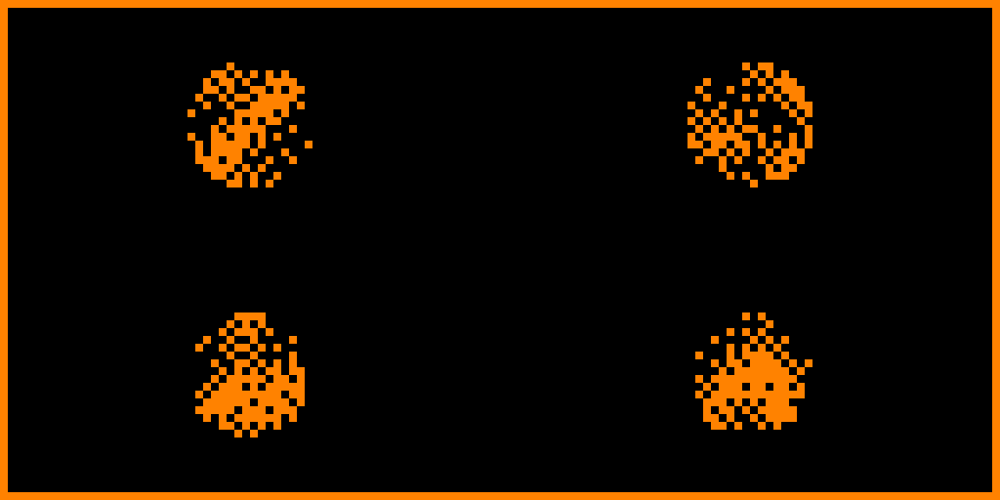
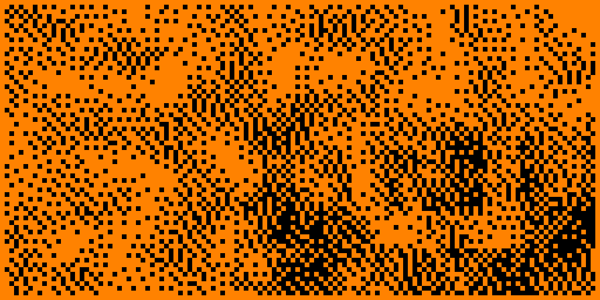
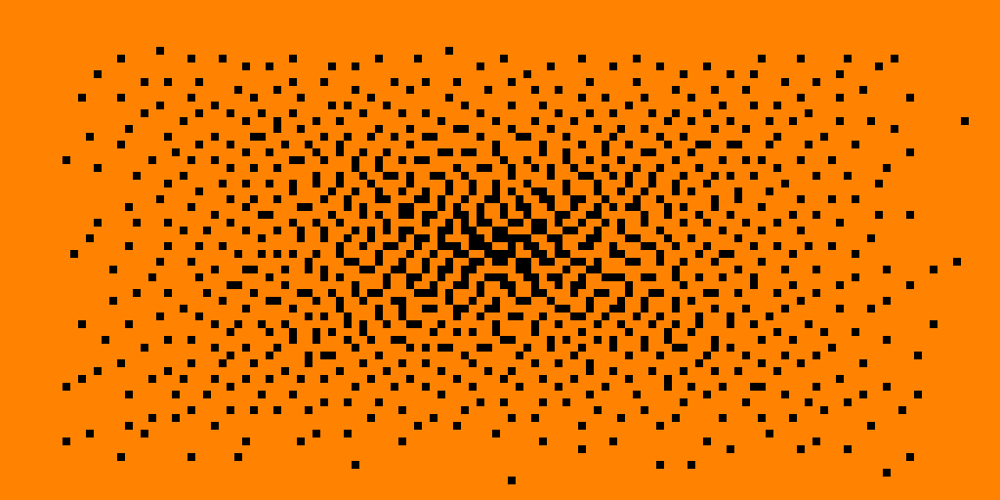
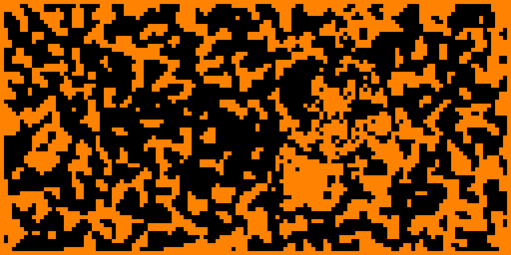

# 🎨 Flipper Zero Generative Art

> **Real-time generative art and animated patterns for your Flipper Zero**

A beautiful, lightweight application that generates mesmerizing animated patterns in real-time using advanced dithering algorithms optimized for the Flipper Zero's 128x64 monochrome display.


## ✨ Features

- 🌈 **10 Gradient Types**: Horizontal, vertical, radial, diagonal, sine waves, interference, checkerboard, noise, and spiral
- 🎬 **Real-time Animation**: Smooth 30 FPS with auto-evolving parameters every second  
- 🖼️ **Floyd-Steinberg Dithering**: Professional-quality 1-bit graphics conversion
- 🎮 **Interactive Controls**: Live pattern manipulation and frequency adjustment
- ❓ **Help System**: Built-in instructions accessible anytime
- ⚡ **Lightweight**: Minimal memory footprint and optimized performance

## 🖼️ Gallery

Here are some examples of the beautiful patterns generated by the app:

<div align="center">

| Gradient Patterns | Shape Integration |
|---|---|
|  |  |
| *Complex layered gradients with dithering* | *Pixel art shapes with noise overlay* |

| Geometric Forms | Organic Patterns |
|---|---|
|  |  |
| *Mathematical precision meets artistic flow* | *Smooth circular gradients* |

|  |
|---|
| *Dynamic interference patterns* |

</div>

*All patterns are generated in real-time and continuously evolve while the app runs*

## 🎮 Controls

| Button | Action |
|--------|--------|
| `OK` | Generate new random pattern |
| `↑` / `↓` | Change gradient type |
| `←` / `→` | Adjust frequency/animation speed |
| `Back` | Show help screen |
| `Back` (hold 2s) | Exit application |

## 📦 Installation

### Method 1: qFlipper (Recommended)

1. Download the latest `flipper_generative_art.fap` from [Releases](https://github.com/ejfox/flipper-generative-art/releases)
2. Connect your Flipper Zero to qFlipper
3. Navigate to **File Manager** → **SD Card**
4. Create folder: `/ext/apps/Graphics/` (if it doesn't exist)
5. Copy `flipper_generative_art.fap` to `/ext/apps/Graphics/`
6. Access via **Apps** → **Graphics** → **Generative Art**

### Method 2: Manual SD Card

1. Remove SD card from Flipper Zero
2. Copy `flipper_generative_art.fap` to `/ext/apps/Graphics/` on SD card
3. Reinsert SD card and navigate to **Apps** → **Graphics** → **Generative Art**

## 🔧 Building from Source

### Prerequisites
- [Flipper Zero Firmware](https://github.com/flipperdevices/flipperzero-firmware) development environment
- Flipper Build Tool (fbt)

### Build Steps

1. **Clone firmware and this app:**
   ```bash
   git clone --recursive https://github.com/flipperdevices/flipperzero-firmware.git
   cd flipperzero-firmware/applications/examples/
   git clone https://github.com/ejfox/flipper-generative-art.git
   ```

2. **Build the FAP:**
   ```bash
   cd ../../
   ./fbt faps
   ```

3. **Locate compiled app:**
   ```
   build/f7-firmware-D/.extapps/flipper_generative_art.fap
   ```

### File Structure
```
flipper-generative-art/
├── application.fam          # App manifest
├── flipper-lightweight-gen.c # Main application code
├── icon.png                 # App icon
└── README.md               # This file
```

## 🧪 Testing

### Simulator Testing
```bash
./fbt firmware_all  # Build firmware with app included
```

### Hardware Testing
1. Install using one of the installation methods above
2. Navigate to **Apps** → **Graphics** → **Generative Art**
3. Experiment with controls and enjoy the patterns!

## 🔬 Technical Details

- **Display**: Optimized for 128×64 monochrome LCD
- **Frame Rate**: 30 FPS real-time rendering
- **Memory**: Lightweight design with minimal RAM usage
- **Algorithm**: Floyd-Steinberg dithering for smooth gradients
- **Patterns**: Procedural generation with auto-evolving parameters

## 🎯 Pattern Types

| Type | Description |
|------|-------------|
| **Horizontal** | Linear left-to-right gradients |
| **Vertical** | Linear top-to-bottom gradients |
| **Radial** | Circular gradients from center |
| **Diagonal** | Corner-to-corner patterns |
| **Sine Wave** | Smooth mathematical waves |
| **Cosine Wave** | Phase-shifted wave patterns |
| **Interference** | Wave interaction patterns |
| **Checkerboard** | Dynamic tile patterns |
| **Noise** | Procedural texture generation |
| **Spiral** | Rotating geometric patterns |

## 🤝 Contributing

Contributions are welcome! Please feel free to:
- 🐛 Report bugs in [Issues](https://github.com/ejfox/flipper-generative-art/issues)
- 💡 Suggest new features
- 🔧 Submit pull requests
- 📖 Improve documentation

## 📄 License

This project is licensed under the MIT License - see the [LICENSE](LICENSE) file for details.

## 🙏 Acknowledgments

- Built for the [Flipper Zero](https://flipperzero.one/) platform
- Inspired by classic demo scene graphics and generative art
- Uses Floyd-Steinberg dithering algorithm for optimal display quality

---

<div align="center">
Made with ❤️ for the Flipper Zero community
</div>